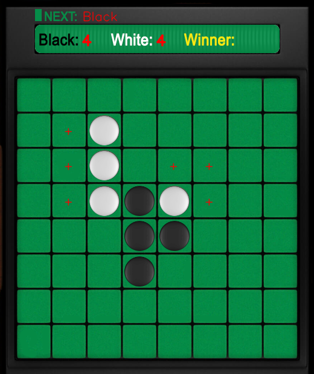
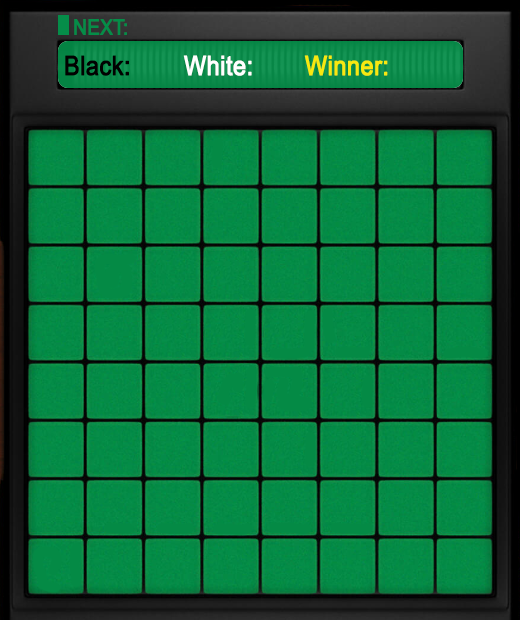

## Build Othello/Reversi game environment with fancy GUI for Reinforcement Learning
[Reversi](https://en.wikipedia.org/wiki/Reversi) (aka Othello) is a game that I knew and played since I was in middle school. 
You can play with a PC or another human player. The rule is very simple. You can have a try [here](https://www.mathsisfun.com/games/reversi.html).
After trying many times I figured our myself without reading any tutorials that the positions at the four corners, and along the four boundaries are very critical places. 
You must think very carefully before putting your pieces there.

After so many years, I am now a researcher and a fan of AI. Suddenly one day I recalled this game and asked myself why 
not build an AI agent and train it to play Reversi. After some searches, 
I found that there are indeed many peoples sharing their experience of doing this. 
But their efforts are not on a fancy Reversi environment such as seemingly 3D pieces and board 
but on simpy table-like texts (their algorithms / ML models are excellent though). I am not sure if there exist one for fun or research purposes, but I gave up further 
searching and decided to build a fancy Reversi environment for my like the picture below:


As you can see, with this environment, you have the naturalness of the pieces and the board. You can the hint of possible positions for the next player (the red "+" sign).
You have piece counter. It will make the ML model developing process more interesting.

In the following parts I will introduce how to build such a Reversi environment for your reinforcement learning algorithms.
I build some agents with some basic strategies and at least my agent is able to beat the random strategy at 80% probability.

All these are just for fun!

### Element preparation 
You need to prepare:
* a board of 8x8 empty grids (you can design it to be any style you like)  
* a white piece (or any color you like)    
* a black piece (or any color you like)    

You may notice that the pieces have the green background color identical to the board. It does not matter, when put on the board no one would tell it is the color of the board or the color from the piece since they are exactly the same.  

That's enough for buiding the environment. Now we need some coding.

### Python with Gym
My computer has dual operating systems (Windows + Ubuntu). All the following procedures are on Window.

Platform information: Anaconda, PyCharm, opencv-python, gym. I assume you have no problem in setting this up.

#### reversi_env.py
It includes essential classes and methods for realizing the interactive Reversi game.
The class Reversi may be the most important part:
```python
class Reversi:
    def __init__(self, human_VS_machine=False):
        ...
    def reset(self):
        ...
    def __refresh_canvas(self):
        ...
    def render(self, mode='human'):
        ...
    def step(self, action: tuple):
        ...
    def __put(self, i:int, j:int, color:str):
        ...
    def __get_possible_actions(self, color):
        ...
    def get_random_action(self):
        ...
    def close(self):
        ...
    def __piece_count(self):
        ...
    def __check_termination(self):
        ...
    def get_human_action(self):
        ...
```
Acutally, it just weakly relies on Gym since only the data type is used such as `self.observation_space = spaces.Discrete(8 * 8)`, all the other realizations are indepandent from Gym (but the entire framework was referred to Gym realizations).
Some basic ideas and cautions:
* Putting a piece in a grid is a process of getting the exact pixel coordinates in a grid, like (y:row, x:col), 
  which  represents the upper left position inside the grid where to put the piece), 
  then replacing the pixels of part of the grid with the pixcels of a piece. The size of a piece is smaller than the size of a grid.
* The global variable `self.next_player` indicates who is the next player. 
  Normally each player takes its turn to put a piece on the board. 
  Be aware of that in some cases when it is impossible for a player to put a piece, he loses his turn and the other player will continue to play.
* The method `__get_possible_actions(self, color)` is to get possible grids where the next player can put his piece. 
  Remember that only the grids where he can reverse the opponent's color are allowed to put a piece. 
  It returns a set of coordinates (each of which corresponds to a grid).
  The red "+" signs are shown based on the returned values of this method.   
* The method `get_human_action(self)` reads the location of your mouse and chech if it is a legal position to put a piece. If legal, a piece of a corresponding color will be put in the grid.
* `get_random_action(self)` realizes a random strategy by choosing randomly a possible grid where a piece is going to be put.
* `__put(self, i:int, j:int, color:str)` implement the process of puting a piece and reversing your opponent's color to yours wherever the rule applicable.
* `__refresh_canvas(self):` and `render(self, mode='human')` refresh the visualized board with pieces, and display the updated count of each color.
* `__check_termination(self)` chechs whether the game is over. Normally the game is over when the board is full of pieces. Sometimes when it is impossible for either player to put a peice, the game ends in advance with a few empty grids.

That's probably it. All implementations details are in the reversi_env.py file. 